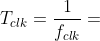
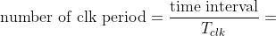

## Preparation tasks (done before the lab at home)

The Nexys A7 board provides five push buttons for user applications.

1. See [schematic](https://github.com/tomas-fryza/digital-electronics-1/blob/master/docs/nexys-a7-sch.pdf) or [reference manual](https://reference.digilentinc.com/reference/programmable-logic/nexys-a7/reference-manual) of the Nexys A7 board and find out the connection of these push buttons, ie to which FPGA pins are connected and how (schema). What logic/voltage value do the buttons generate when not pressed and what value when the buttons are pressed? Draw the schematic with push buttons.

`
##Buttons
#set_property -dict { PACKAGE_PIN C12   IOSTANDARD LVCMOS33 } [get_ports { CPU_RESETN }]; #IO_L3P_T0_DQS_AD1P_15 Sch=cpu_resetn

#set_property -dict { PACKAGE_PIN N17   IOSTANDARD LVCMOS33 } [get_ports { BTNC }]; #IO_L9P_T1_DQS_14 Sch=btnc

#set_property -dict { PACKAGE_PIN M18   IOSTANDARD LVCMOS33 } [get_ports { BTNU }]; #IO_L4N_T0_D05_14 Sch=btnu

#set_property -dict { PACKAGE_PIN P17   IOSTANDARD LVCMOS33 } [get_ports { BTNL }]; #IO_L12P_T1_MRCC_14 Sch=btnl

#set_property -dict { PACKAGE_PIN M17   IOSTANDARD LVCMOS33 } [get_ports { BTNR }]; #IO_L10N_T1_D15_14 Sch=btnr

#set_property -dict { PACKAGE_PIN P18   IOSTANDARD LVCMOS33 } [get_ports { BTND }]; #IO_L9N_T1_DQS_D13_14 Sch=btnd

`

2. Calculate how many periods of clock signal with frequency of 100&nbsp;MHz contain time intervals 2&nbsp;ms, 4&nbsp;ms, 10&nbsp;ms, 250&nbsp;ms, 500&nbsp;ms, and 1&nbsp;s. Write values in decimal, binary, and hexadecimal forms.

   &nbsp;
    1*10^-8 s
   &nbsp;

   
   &nbsp;
   <!--
   https://editor.codecogs.com/
   T_{clk}=\frac{1}{f_{clk}}=
   \textup{number of clk period} = \frac{\textup{time interval}}{T_{clk}}=
   -->

   | **Time interval** | **Number of clk periods** | **Number of clk periods in hex** | **Number of clk periods in binary** |
   | :-: | :-: | :-: | :-: |
   | 2&nbsp;ms | 200 000 | `x"3_0d40"` | `b"0011_0000_1101_0100_0000"` |
   | 4&nbsp;ms | 400 000 | `x"6_1A80"` | `b"0110_0001_1010_1000_0000"` |
   | 10&nbsp;ms | 10 000 000 | `x"98_9680"` | `b"1001_1000_1001_0110_1000_0000"` |
   | 250&nbsp;ms | 25 000 000 | `x"17D_7840"` | `b"0001_0111_1101_0111_1000_0100_0000"` |
   | 500&nbsp;ms | 50 000 000 | `x"2FA_F080"` | `b"10_1111_1010_1111_0000_1000_0000"` |
   | 1&nbsp;sec | 100 000 000 | `x"5F5_E100"` | `b"0101_1111_0101_1110_0001_0000_0000"` |

